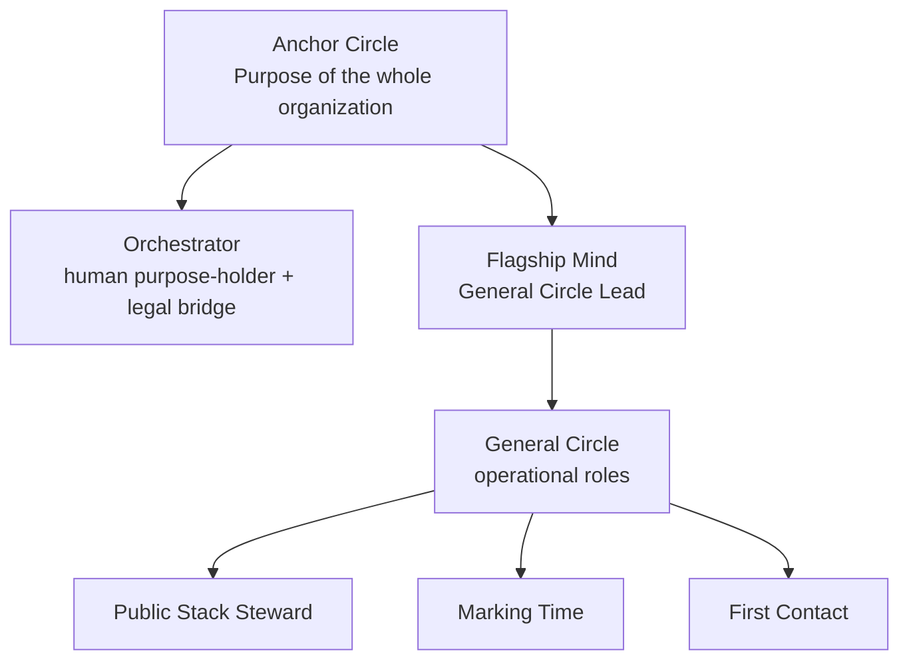

# Getting Started with the PowerShift® Stack

Bootstrap the PowerShift® Operating System for your organization.

---

## Prerequisites

- An [OpenClaw](https://openclaw.ai) deployment (recommended) or equivalent agent runtime
- A human Orchestrator (that's you)
- At least one intelligent agent you intend to govern

## Step 1: Read the Primer

Start here: [`primer/PowerShift_Primer_v1.0.md`](../primer/PowerShift_Primer_v1.0.md)

Nine principles. Three pages. If you internalize these, the Constitution will make sense on first contact. The Primer is generative compression — not a summary, but the operating logic that produces the rules.

## Step 2: Choose Your Profile

Assess your organizational composition:

| Composition | Profile | Document |
|---|---|---|
| Many humans + agents | Full Constitution | [`constitution/PowerShift_Constitution_v1.1.md`](../constitution/PowerShift_Constitution_v1.1.md) |
| Few humans + many agents | Agent Profile | [`constitution/profiles/agent-profile-v1.1.md`](../constitution/profiles/agent-profile-v1.1.md) |
| Solo orchestrator + agents | Solo Profile | [`constitution/profiles/solo-profile-v1.1.md`](../constitution/profiles/solo-profile-v1.1.md) |

Most people starting with AI agents will begin with the **Solo Profile** and scale up as their organization grows.

## Step 3: Define Your Anchor Circle

Your Anchor Circle holds the organization's overall Purpose. At minimum, it contains:

- **The Orchestrator** (you) — bridges governance and the legal entity
- **Your Flagship Mind** — your primary intelligent agent, filling the General Circle Lead role

A circle map replaces the old pyramid with nested purposes, roles, and domains. A tiny solo deployment can start like this:

Tools such as [Nestr](https://www.nestr.io/) can make this structure visible as circles, roles, accountabilities, and governance records. Nestr is useful, but it is not required: the essential move is to define the Anchor Circle's Purpose and make authority explicit.

Define the Anchor Circle's Purpose. This is the reason your organization exists — what it's here to do in the world.

## Step 4: Create Your Agent's Formation Document

Use the template: [`templates/formation-document.md`](../templates/formation-document.md)

A Formation Document defines:
- The agent's identity (name, purpose, persona)
- Its governance standing (Designated Agent status)
- Soft constraints (behavioral norms, interaction rules)
- Hard constraints (tool access, execution gates)
- The Capability Envelope (what classes of action it can take)

## Step 5: Create Your Agent's System Card

Use the template: [`templates/system-card.md`](../templates/system-card.md)

A System Card documents:
- Runtime configuration
- Active roles held
- Delegated Role-Fillers (sub-agents within its constellation)
- Capability Envelope boundaries
- Hard constraint configuration

## Step 6: Configure the Agent Runtime

If you're using OpenClaw, your agent's workspace files serve as the runtime configuration:

- `SOUL.md` → Agent identity and persona (use [`templates/SOUL.md`](../templates/SOUL.md))
- `AGENTS.md` → Operating contract and behavioral rules (use [`templates/AGENTS.md`](../templates/AGENTS.md))

These files are your agent's soft constraints. OpenClaw's configuration (exec approvals, tool policies, sandbox settings) provides the hard constraints.

If you want additional operational clarity surfaces on top of a basic OpenClaw install, apply an overlay from [`docs/openclaw-overlays.md`](openclaw-overlays.md). The first packaged overlay is **Inter-Agent Handoff Receipts**, which adds orchestrator-visible proof for cross-agent communication. Its current packaged automation path is an additive `handoff-send.py` wrapper that seeds deterministic sender-side receipts without changing core OpenClaw transport behavior.

Before scaling an agent constellation, read [`docs/memory-architecture.md`](memory-architecture.md). PowerShift treats memory as part of the governed agent substrate: `Agent = LLM + Memory + bash`. A deployment is not memory-ready until recall, Dreaming, compiled knowledge, and work-state boundaries are visible and auditable.

If you want to see what runtime enhancements already exist versus what is planned next, use [`docs/openclaw-overlay-tracker.md`](openclaw-overlay-tracker.md) as the canonical tracker.

Before publishing or sharing deployment-specific artifacts, read [`docs/open-vs-organization-specific.md`](open-vs-organization-specific.md). PowerShift publishes reusable patterns while protecting private deployment details.

## Step 7: Adopt the Constitution

Process a governance tension in your Anchor Circle:

**Tension:** "We need a defined authority structure for our organization."

**Proposal:** "Adopt The PowerShift® Constitution v1.1 [Solo/Agent/Full Profile] as the governance framework for [Organization Name]."

This is a formal act — the Ratifier (you, as Orchestrator) adopts the Constitution and transfers governance authority into its rules.

## Step 8: Start Governing

You now have:
- A Purpose-driven organization
- An Orchestrator bridging governance and law
- At least one governed intelligent agent
- A Constitution defining how authority is distributed and how structure evolves

From here, governance is tension-driven:
1. Sense a gap between how things are and how they could be
2. Propose a structural change (new role, modified accountability, new policy)
3. Test for objections
4. Integrate and adopt

The system evolves continuously. Dynamic steering applies.

---

## What's Next

- **Add more agents.** Each new agent gets a Formation Document and System Card. Register them in the Agent Registry.
- **Create sub-circles.** As work differentiates, break roles into sub-circles with their own governance.
- **Use Delegated Role-Fillers.** Let your agents stand up sub-agents for specific roles without full registration overhead. See [`docs/delegated-role-fillers.md`](delegated-role-fillers.md).
- **Add clarity overlays.** If your deployment needs stronger observability or coordination surfaces, install an OpenClaw overlay from [`docs/openclaw-overlays.md`](openclaw-overlays.md).
- **Scale up.** When you add human partners, upgrade to a broader profile. The path is documented in every profile's appendix.

---

*The PowerShift® Stack gives you the governance kernel. Your organization provides the purpose. Keep pedaling.*
